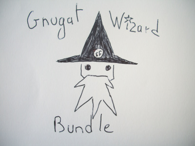

# Gnugat Wizard Bundle

Provides two commands to register a bundle in a [Symfony2](http://symfony.com/)
application.

No more manual edition of `app/AppKernel.php`, everything is done
programmatically!

Read more about this project with the following
[introduction](Resources/doc/01-introduction.md).

## Installation

Install this bundle using [Composer](https://getcomposer.org/):

    composer require gnugat/wizard-plugin:~1

Then register it in the application's kernel (this is the last time you'll need
to do this).

Discover more with the [installation documentation](Resources/doc/02-installation.md).

## Usage

If you know the Fully Qualified ClassName (FCQN) of the bundle (it's the class
name with its full namespace), then run:

    app/console wizard:register:bundle 'Acme\Bundle\AcmeDemoBundle'

If you know the [Composer](https://getcomposer.org/) package name, then run:

    app/console wizard:register:package 'acme/demo-bundle'

Read more about the usage with the [documentation](Resources/doc/03-usage.md).

## Tests

You can run the tests with the following script:

    sh bin/tester.sh

Grasp more about those tests by having a look at the
[documentation](Resources/doc/04-tests.md).

## Further documentation

You can see the current and past versions using one of the following:

* the `git tag` command
* the [releases page on Github](https://github.com/gnugat/GnugatWizardBundle/releases)
* the file listing the [changes between versions](CHANGELOG.md)

You can find more documentation at the following links:

* [copyright and MIT license](LICENSE)
* [versioning and branching models](VERSIONING.md)
* [contribution instructions](CONTRIBUTING.md)
* [documentation directory](Resources/doc)

This project began as a hackday at [SensioLabs](http://sensiolabs.com/), with
the silent help (they don't appear in the commits) of:

* [Inal Djafar](https://github.com/inalgnu)
* [Thomas Gay](https://github.com/thomas-gay)
* [Kathryn Greer](https://github.com/KathrynG)
* [Julien Didier](https://github.com/juliendidier)
* [François Gueguenn](https://github.com/fgueguen)
* [Jérémy Romey](https://github.com/jeremyFreeAgent)
* [Reinis Grinbergs](https://github.com/rpg600)
* [Clément Bertillon](https://github.com/skigun)

Here's the [commit contributors](https://github.com/gnugat/GnugatWizardBundle/graphs/contributors).
